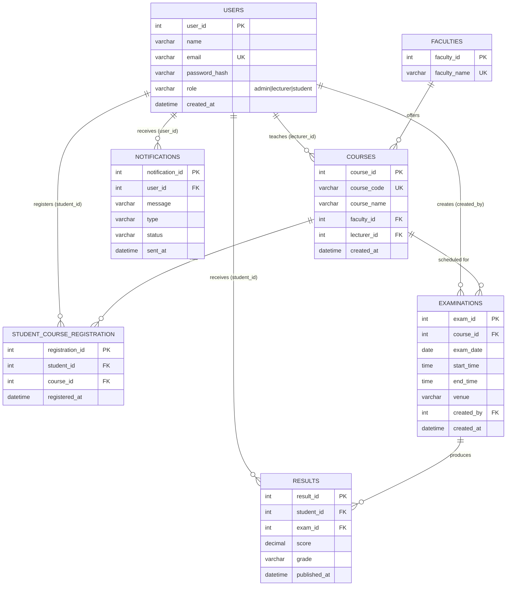

# Entity Relationship Diagram

Exam Scheduling & Result Management System — 7 related tables.

## Relationship Notes

- **USERS → COURSES** (1:M): a lecturer teaches many courses; a course has one lecturer.
- **USERS ↔ COURSES via STUDENT_COURSE_REGISTRATION** (M:N): a student registers for many courses; a course has many students.
- **COURSES → EXAMINATIONS** (1:M): a course can have multiple scheduled examinations.
- **EXAMINATIONS → RESULTS** (1:M): each exam produces one result per registered student (`UNIQUE(student_id, exam_id)` prevents duplicates).
- **USERS → NOTIFICATIONS** (1:M): a user receives many notifications (schedule alerts, result-published alerts).
- **FACULTIES → COURSES** (1:M): a faculty offers many courses.

## Data Integrity

- All foreign keys enforced with `PRAGMA foreign_keys = ON` (SQLite) / standard `FOREIGN KEY ... REFERENCES` (MySQL/PostgreSQL equivalent).
- `UNIQUE` constraints: `users.email`, `courses.course_code`, `faculties.faculty_name`, `(student_id, course_id)` on registrations, `(student_id, exam_id)` on results.
- `CHECK` constraints: `users.role` restricted to enum, `results.score` restricted to 0–100.
- Cascading deletes on dependent join/child tables (registrations, exams-under-course, results-under-exam, notifications-under-user) so removing a parent record does not orphan rows.
